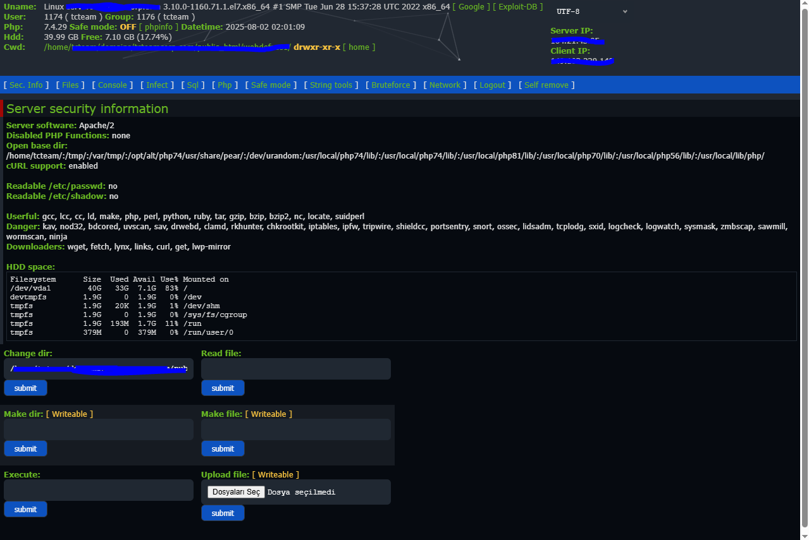

# WSO-SHELL

# 🔒 WSO Shell - New and FULL Version !!

⚠️ **DISCLAIMER**  
This project is strictly intended for **educational and ethical purposes** only.  
Do not use this tool on systems you do not own or have explicit written permission to test.  
I am not responsible for any misuse.

---

## 🧠 What is this?

This is a modified and sanitized version of the classic WSO (Web Shell by Orb), intended for use in CTF environments, lab simulations, or ethical hacking exercises.

---

## 🛠 Features

- Lightweight PHP-based web shell
- File manager, command execution, database interaction
- Password-protected access
- Logging for audit trails (in this version)

---

## 🧪 Usage

> ⚠️ Run this only in **controlled lab environments.**

1. Copy `shell.php` to your test server.
2. Access via browser.
3. Enter the password.
4. Conduct your authorized tests.

---

## 📜 License

This code is provided "as is" for educational purposes only.

---

## 🙏 Credits

Based on the original [WSO Shell by Orb] with heavy modifications for ethical use.

